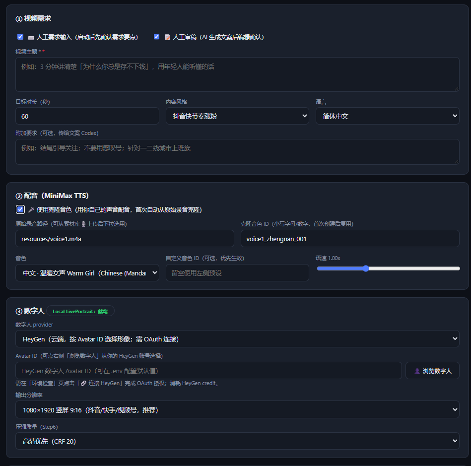
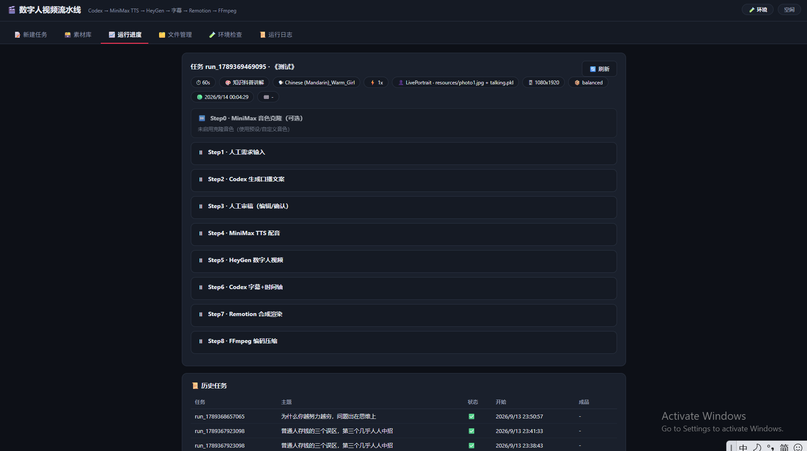

<div align="center">

# 🎬 数字人视频流水线

**一句话介绍**：一条完全跑在你自己电脑上的自媒体短视频生产线 —— AI 写稿、你审稿定稿、克隆你自己的声音配音、生成数字人口播视频、自动加字幕合成出片。

`Codex 文案` → `MiniMax 声音克隆/TTS` → `HeyGen 数字人` → `Codex 字幕` → `Remotion 合成` → `FFmpeg 压缩`


</div>

---

## ✨ 特性

- **🧑‍💼 人机协作，不是全自动黑盒**：AI 写稿前后各有一道人工关卡（Step1 需求确认、Step3 文稿审稿定稿），改完稿才进配音；两个人工环节都可开关
- **🎙️ 用你自己的声音说话**：一段 ≥10 秒的录音即可完成 MiniMax 声音复刻（自动补静音、克隆后基频验证），之后每条视频都用你的音色配音
- **🔌 HeyGen Remote MCP 接入**：官方 CLI 不支持 Windows？本项目直接对接 [HeyGen Remote MCP](https://developers.heygen.com/cli)，浏览器 OAuth 一键授权，**无需 API Key**，消耗你现有套餐额度
- **🖥️ Web 控制台**：需求表单、流水线进度、人工确认弹窗、分类素材库、文件管理（在线预览 mp4/wav/srt）、环境自检、日志查看，一个页面全搞定
- **💰 调试模式**：先跑「文案 + 配音 + 字幕」不进 HeyGen，校准满意后再出片，**不浪费 credit**
- **🛟 工程化兜底**：严格串行 + 每步产物校验（ffprobe/时长/条数）、单步重试、状态持久化（重启控制台可继续确认人工环节）、历史产物自动归档、结束后一键清理临时文件

## 🔄 工作流

```
┌──────────┐   ┌──────────┐   ┌──────────┐   ┌──────────┐
│ Step0    │   │ Step1    │   │ Step2    │   │ Step3    │
│ 声音克隆  │──▶│ 人工需求  │──▶│ Codex    │──▶│ 人工审稿  │
│ (可选)   │   │ 输入 ✍️  │   │ 生成文案  │   │ 定稿 ✍️  │
└──────────┘   └──────────┘   └──────────┘   └────┬─────┘
                                        ┌─────────▼────────┐
┌──────────┐   ┌──────────┐   ┌─────────┴──┐   ┌──────────┐
│ Step8    │◀──│ Step7    │◀──│ Step6      │◀──│ Step5    │◀── Step4 MiniMax TTS（克隆音色）
│ FFmpeg   │   │ Remotion │   │ Codex      │   │ HeyGen   │      output/02_audio.wav
│ 压缩出片  │   │ 字幕合成  │   │ 字幕时间轴  │   │ 数字人   │
│ 06.mp4   │   │ 05.mp4   │   │ 04.srt     │   │ 03.mp4   │
└──────────┘   └──────────┘   └────────────┘   └──────────┘
```

- `Step1 / Step3` 人工环节：流水线暂停为 `waiting` 状态，控制台自动弹出编辑器，确认后继续；关浏览器、重启服务都不丢
- `runMode` 运行范围：`full`（全流程）/ `audio`（文案+配音+字幕，不进 HeyGen）/ `tts` / `script`

## 🚀 快速开始

### 环境要求

| 依赖 | 说明 | 安装 |
|---|---|---|
| Node.js ≥ 18 | 控制台 + Remotion 渲染 | [nodejs.org](https://nodejs.org) |
| Codex CLI | Step2 文案 / Step6 字幕 | `npm install -g @openai/codex` 后 `codex login` |
| MiniMax CLI (mmx) | Step0 克隆 / Step4 TTS | 见下方三步 |
| HeyGen 账号 | Step5 数字人（Remote MCP，免 API Key） | 控制台内一键 OAuth 连接 |
| FFmpeg | Step8 压缩 + 全程媒体校验 | `winget install Gyan.FFmpeg` / `scoop install ffmpeg` |
| Remotion 依赖 | Step7 合成 | 启动脚本自动 `npm install` |

> 以上缺失项会在**启动时的环境自检**中逐项报出并给出安装命令，缺依赖直接拒绝启动。

### 三步接入

```bash
git clone <本仓库> && cd 自媒体数字人工作流

# 1) 配置（密钥集中放 .env 或 secrets/.api_keys.json）
cp .env.example .env

# 2) 安装并登录 MiniMax CLI
npm install -g mmx-cli
mmx auth login --api-key sk-xxxxx        # https://platform.minimaxi.com 获取
mmx quota                                # 验证额度生效

# 3) 一键启动（Windows 双击 start.bat；macOS/Linux 运行 ./start.sh）
start.bat
#   → 环境自检(自动装 Remotion 依赖) → 打开 http://127.0.0.1:7788
#   → 「环境检查」页点「🔗 连接 HeyGen」完成一次 OAuth 浏览器授权
```

### 产出第一条视频

1. 「📝 新建任务」填主题 / 时长 / 音色 / 分辨率等，勾选人工环节与运行范围
2. 流水线在 **Step1 暂停** → 弹窗确认/补充需求 → AI 写稿
3. **Step3 暂停** → 弹窗审稿，直接改字 → 确认定稿
4. 自动完成配音 → 数字人 → 字幕 → 合成 → 压缩
5. 完成后询问是否清理临时文件；成品在 **`output/06_final_video.mp4`**，控制台可在线预览

> 💡 建议第一次先用运行范围「调试：文案+配音+字幕」校准效果，满意后从 Step5 重跑补全出片（不重复消耗 Codex/克隆）。

## 🗃️ 素材库

控制台「素材库」页分类引导上传，本地落盘 `./materials/`：

| 分类 | 目录 | 说明 |
|---|---|---|
| 🎙️ 原始录音 | `materials/voice/` | 声音克隆源，上传后自动出现在克隆源下拉框 |
| 🧑 数字人照片 | `materials/photo/` | HeyGen 照片数字人参考 |
| 🖼️ 图片 / 🎵 音乐 / 🎬 视频 / 📄 文案 | `materials/...` | 入库保存，供后续合成版本引用 |

格式不符会拦截并提示正确分类；支持在线预览 / 下载 / 删除。

## ⚙️ 配置（.env）

完整模板见 [`.env.example`](./.env.example)，密钥读取优先级：`process.env → .env → secrets/.api_keys.json`。

| 变量 | 说明 |
|---|---|
| `MINIMAX_API_KEY` / `MINIMAX_TTS_MODEL` | MiniMax 密钥（也可 `mmx auth login` 持久化）/ TTS 模型，默认 `speech-2.8-hd` |
| `CODEX_MODEL` / `CODEX_TIMEOUT_MS` | Codex 模型（留空用默认）/ 超时 |
| `HEYGEN_AVATAR_ID` / `HEYGEN_TIMEOUT_MS` | 默认数字人 / Step5 超时 |
| `HEYGEN_PROXY` | 访问 `mcp.heygen.com` 的代理（如 Clash `http://127.0.0.1:7890`；中国大陆网络通常需要） |
| `FFMPEG_PATH` / `FFPROBE_PATH` | 默认取 PATH，可填绝对路径 |
| `PORT` | 控制台端口，默认 7788（仅监听 127.0.0.1） |

> **网络说明**：中国大陆直连 `mcp.heygen.com` 受 DNS 污染影响，配置 `HEYGEN_PROXY` 指向本地代理即可；MiniMax / Codex 无需代理。

## 🧩 流水线步骤与产物

| 步骤 | 引擎 | 产物 | 关键校验 |
|---|---|---|---|
| Step0 声音克隆（可选） | MiniMax `/v1/voice_clone` | `logs/cloned_voice.json` | <10s 自动补静音；克隆后基频探针验证 |
| Step1 人工需求（可选） | 控制台弹窗 | `logs/human_brief.txt` | 等待无超时，重启可续 |
| Step2 AI 文案 | 本地 Codex CLI | `output/01_script.txt` | ≥20 字；流式截断兜底解析 |
| Step3 人工审稿（可选） | 控制台弹窗 | `output/01_script.txt` 定稿 | 定稿后 TTS/字幕均用此版 |
| Step4 TTS 配音 | mmx speech | `output/02_audio.wav` | 时长 ≥0.5s；认证/额度错误码翻译 |
| Step5 数字人 | HeyGen Remote MCP | `output/03_heygen_raw.mp4` | 音频驱动口型；轮询+下载+校验 |
| Step6 字幕 | 本地 Codex CLI | `output/04_subtitle.srt` | 条数合理性/去重/时间轴修复 |
| Step7 合成 | Remotion（程序化渲染） | `output/05_remotion_composed.mp4` | 字幕/标题/水印/进度条叠加；时长对齐 |
| Step8 压缩 | FFmpeg libx264 | `output/06_final_video.mp4` | CRF 档位可选；faststart |

完整规范（状态机、重试规则、API、二次开发）见 **[agent.md](./agent.md)**。

## 🖥️ 控制台截图

| 新建任务 | 运行进度 |
|---|---|
|  |  |

> 截图待补充：可在本地启动后于 `docs/` 目录放置 `screenshot-create.png`、`screenshot-progress.png`、`screenshot-materials.png`。

## 📂 目录结构

```
├── start.bat / start.sh      # 一键启动（内置环境自检，缺依赖拒绝启动）
├── scripts/check-env.js      # 环境校验 CLI（--autofix 自动装 Remotion 依赖）
├── server/                   # 控制台服务（纯 Node 内置模块，无第三方依赖）
│   ├── index.js              # HTTP API + 静态前端 + 文件流(Range预览)/上传
│   ├── pipeline.js           # 流水线执行器（9 步串行/状态机/人工环节/重试/归档）
│   ├── heygen_mcp.js         # HeyGen Remote MCP 客户端（OAuth+PKCE/代理/工具调用）
│   ├── envcheck.js / utils.js
├── web/                      # 前端（原生 HTML/JS/CSS，无构建）
├── remotion/                 # Step7 合成工程（bundler+renderer 程序化渲染）
├── materials/                # 素材库（分类目录）
├── output/                   # 步骤产物 01~06 + archive/ 历史归档
├── logs/                     # pipeline.log / state.json / 各步骤子日志
├── secrets/                  # 密钥与 OAuth 令牌（不入库）
└── agent.md                  # 完整项目规范文档
```

## ❓ FAQ

<details>
<summary><b>HeyGen 官方 CLI 不支持 Windows，怎么解决的？</b></summary>

官方 CLI 是未签名单文件，Windows 上会被 Smart App Control 拦截，且 README 仅支持 macOS/Linux/WSL。本项目改为直连 **HeyGen Remote MCP**（`https://mcp.heygen.com/mcp/v1/`，MCP 官方支持的接入方式）：完整实现了 OAuth 2.0 授权码 + PKCE + 动态客户端注册，控制台一键发起浏览器授权，令牌自动刷新。
</details>

<details>
<summary><b>听起来还是默认音色，克隆没生效？</b></summary>

用声学方法自查：`python scripts/f0.py output/02_audio.wav <你的源录音路径>`（男声 ~90Hz、女声 ~230Hz 量级）。Step0 首次克隆会自动合成探针比对基频，差异过大会在步骤里告警；另确认听的不是上一轮旧视频（浏览器可能缓存）。
</details>

<details>
<summary><b>想重新克隆 / 换个声音？</b></summary>

删除 `logs/cloned_voice.json` 后从 Step0 重跑，或换一个克隆音色 ID；新录音在「素材库 → 🎙️ 原始录音」上传后即可在克隆源下拉选用（克隆源也可填项目内任意相对路径）。
</details>

<details>
<summary><b>失败了怎么办？会从头重跑吗？</b></summary>

任一步失败立即终止；「运行进度」页可单步重试或从任意步骤重跑（自动校验上游产物存在；已确认的需求/文稿自动复用；重新生成的文案会再次要求审稿）。
</details>

<details>
<summary><b>Remotion 首次渲染很慢？</b></summary>

首次会自动下载 Headless Chrome（~110MB，仅一次）并打包工程，之后有缓存明显变快。自检命令：`cd remotion && npm run smoke`。
</details>

## 🗺️ Roadmap

- [ ] 素材库图片/音乐/视频接入 Remotion 合成（片头、B-roll、背景音乐混音）
- [ ] HeyGen 照片数字人一键创建（materials/photo → create_photo_avatar）
- [ ] 批量任务队列与定时发布
- [ ] 字幕样式模板（位置/字号/描边）
- [ ] 英文界面与 i18n

## 🤝 致谢

- [MiniMax 开放平台](https://platform.minimaxi.com) & [mmx-cli](https://github.com/MiniMax-AI/cli) — 声音复刻与 TTS
- [HeyGen](https://heygen.com) — 数字人视频与 Remote MCP
- [OpenAI Codex CLI](https://github.com/openai/codex) — 文案与字幕生成
- [Remotion](https://remotion.dev) — React 可编程视频合成
- [FFmpeg](https://ffmpeg.org) — 编码压缩

## 📄 License

[MIT](./LICENSE) — 仅供学习研究。使用 MiniMax / HeyGen / OpenAI 服务时请遵守各自的服务条款；数字人内容请合规使用（获得声音/形象授权，标注 AI 生成）。
